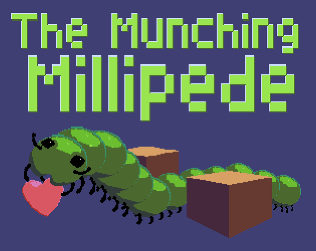

# The Munching Millipede

  
  
<i>Click to play on itch.io</i>

## Introduction

You must guide a hungry millipede around collecting hearts and avoiding obsticles.
This is a snake like game where the millipede is constantly moving and you control which way it should turn. As you collect hearts, your millipede will grow and score points.
There are 10 difficulties that increase the number of obsticals to avoid. Higher difficulties also reward you with more points per heart. Every 10th heart you collect, may also add a single obstical to the play area. Good luck.

## Development

The Munching Millipede game is written in Commodore BASIC 2.0 for the Commodore 64.

- developer: Steve
- brainstorming partners and design guides: April and Isabella

## History

As a kid I always wanted to create video games, but I was too impatient. I would learn a little BASIC here and there, then forget it, and each time I tried was like starting over.
It wasn't util much later in life that I would get back into writing code, and it is as much fun as I alway thought it would be. In the back of my mind I would keep going back to that childhood dream of creating games. I started a couple here and there in JavaScript, but could never quite get one to a finish the finish line. Then one day, I started writing a snake game on the Vice emulator, and that was it. It was finally time to finish one, and not just any one, but one written in the way I would have done it as a kid. This time, I will finish it for real.

- the first iteration was very simple and running in about 2 hours
- after that I continued to polish it with an intro screen and selectable level
- then at about 280 lines of code, the fine tuning was getting a little difficult to work with, so I pulled the code out and created this repository
- I then removed the line numbers and started splitting the code into files, and the speed of the program went up noticeably
- now I'm working on polishing it off and hosting it for others to enjoy, maybe another kid will be inspired to dive in
- I've created issues now for the final finishing touches, but plan to release before I work on those
