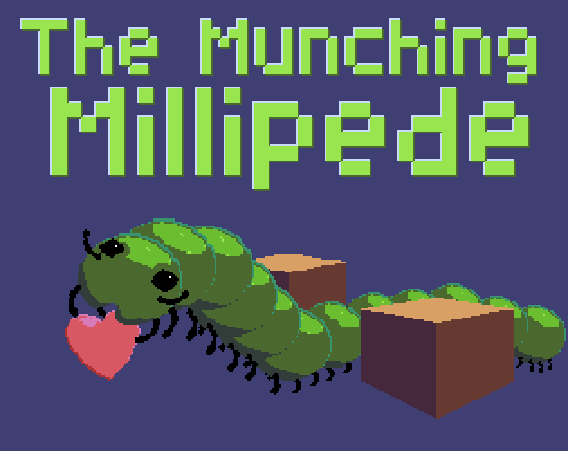

# The Munching Millipede

  
  
<i>Click to play on itch.io</i>

## Introduction

You must guide a hungry millipede around collecting hearts and avoiding obsticles.
The is a snake like game where the millipede is constantly moving and you control which way it should turn. As you collect hearts, your millipede will grow and score points.
There are 10 difficulties that increase the number of obsticals to avoid. Higher difficulties also reward you with more points per heart. Every 10th heart you collect may also add a single obstical to the play area. Good luck.

## Development

The Munching Millipede game is written in Commodore BASIC 2.0 for the Commodore 64.

- developer: Steve
- brainstorming parter and design guides: April and Isabella
